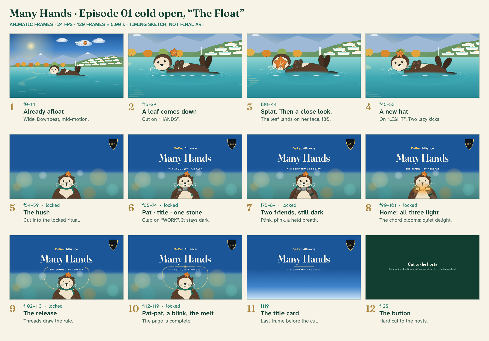

# The cold open: storyboard for Episode 01, "The Float"

*Five seconds, 120 frames at 24 fps. It premieres Wednesday 11 November 2026 at the top of Many Hands 01.*
*This is the definitive storyboard. It governs every frame number and every hit point in the package. `music/THEME-AND-SOUND.md` has been reconciled to it (see §4). It obeys `DECISIONS.md` and matches the locked ritual in `mascot/CHARACTER-BIBLE.md` frame for frame.*

**A playable animatic** of this storyboard is on the review page (`../index.html`), and rendered as `animatic/many-hands-ep01-cold-open-animatic.mp4`. Every frame and every note in it is drawn and synthesized in code so the timing can be judged now. It is a timing sketch, not final art.



---

## 1. What the five seconds are for

A regular should hear the first vibraphone note and feel the show starting. That's the same thing the dancing pandas do for AI Code King's viewers. So the cold open does two jobs and nothing else. For the first 2.25 seconds it delights: an otter floating in an autumn cove turns a falling maple leaf into a hat, and that part is different every episode. For the next 2.75 seconds it performs a ritual that is identical every episode. Tuck holds up a plain grey stone. Two friends' paws bring theirs. At the third stone all three light up together, and their light rises to draw the rule under the show's name. The ritual teaches the whole idea of threshold recovery without a word: one stone never glows, two never glow, and enough of them together light at once. Then the button chord lands and we're with Bruce and Facundo. No voiceover, no episode number, no logo sting. If it isn't five seconds, it isn't the ritual.

---

## 2. The storyboard

**Three shots, two cuts.**

| Shot | Frames | Content |
|---|---|---|
| **Shot 1** (wide) | f0–f14 | Already afloat |
| **Shot 2** (medium) | f15–f53 | The leaf and the hat. The cut in lands on the hook's "HANDS" |
| **Shot 3** (the pocket shot, locked) | f54–f119 | The ritual master. The cut in lands on the hush, the moment the rhythm section stops |

Then the hard cut to the hosts on the button at f120, which is outside the bumper.

Frames are 0-indexed. f0 is the first frame and f119 is the last. At 96 BPM one beat is exactly 15 frames: bar one is f0–f59 and bar two is f60–f119.

| # | Time | Frames | Picture (what an illustrator draws) | Camera | Tuck | Light | Sound (exact) | Its job |
|---|---|---|---|---|---|---|---|---|
| **1** | 0.00–0.58s | f0–f14 | A sunlit autumn cove: calm painted turquoise water, red and gold maples on the near shore, white terraces spilling greenery up a hillside, a thin waterfall, snow on two far peaks. Tuck small in the middle ground, on her back. The maple leaf is already visible high at top right, spinning. A small white air taxi glides left to right above the terraces: the one "tomorrow" detail. | **Wide, locked.** Tuck at 22% of frame height, centred on x 960. Horizon on the upper third. | On her back, paws together on her chest, kelp scarf at her neck. She sculls lazily with her hind flippers, one stroke a beat (f0, f15 lands after the cut). A 2D ripple ring spreads from her on twos. | Golden hour from camera left, warm key, cool sky. The plate is lush and saturated (R4). | **Downbeat f0:** vibes A4 ("MA-"), Rhodes D(add9), upright bass D2, pad (filter at 500 Hz, opening), shaker in. Vibes B4 at f7.5. | Starts mid-motion. There is no establishing black and no fade: the show is already happening when you arrive. |
| **2** | 0.63–1.21s | f15–f29 | Closer: Tuck fills 40% of frame height, lying across lower centre. The leaf spirals down in three flat turns toward her chest. It's a 2D card on twos, and its soft shadow slides over the water and her fur. | **CUT on f15** to a medium shot. Locked. | Her eyes find the leaf and follow it down, with her whiskers trailing 2 frames behind. Paddling slows. | Same key. A sun glint moves along the ripples. | **f15:** vibes D5 ("HANDS"), finger snap. | The cut lands on the hook's top note, and the picture answers the tune. |
| **3** | 1.25–1.83s | f30–f44 | The leaf lands flat over her face, a small comic beat. She peels it off by its edges in both mittens and holds it up to look at it. | Same shot. | **f30:** the leaf lands flat over her face. Her whiskers flare out around it, and her flippers stop mid-scull. **f35–f40:** she peels it off with both paws, blinking. **f40–f44:** she holds it up and inspects it, head tilted 12° (curious). | – | **f30:** Rhodes moves to E/D and the bass re-plucks D2. **The activity sound (A01):** a dry leaf landing on her face. Guitar B4 at f37.5. | The episode's one delightful action. The sound is one small true foley, not a gag. |
| **4** | 1.88–2.21s | f45–f53 | The leaf sits on her crown like a hat, stem up, tipped back so its face reads. | Same shot. | **f45:** she sets it on her crown (on the note). **f47 and f52:** two lazy flipper kicks, the double beat that foreshadows pat-pat. **f49–f53:** her eyes roll up to admire her hat, then drift to frame left. That eyeline continues across the cut. | – | **f45:** guitar G♯4 ("LIGHT"), finger snap. Soft water laps on f47 and f52. | The carry-over arrives by f45 (bible rule 6). Delight, button, done. |
| **5** | 2.25–2.46s | f54–f59 | **The pocket shot. It's a picture-book page.** The top 55% of the frame is the house day sky, a gradient from Zenith through Sky, still empty. The lower 45% is Tuck, chest-up, lens at her eye height, in front of a defocused, 300 K warmer version of the cove (bokeh of turquoise, gold and cream). The maple leaf is on her crown. The shield sits top right. | **CUT on f54** into the locked master. The camera never moves again. | **The hush.** Her head starts three-quarters to frame left (continuing shot 2's eyeline). She turns her face to the lens over f54–f57, whiskers trailing 2 frames, and holds perfectly still for f58–f59. Paws together on her chest. | Warm key from camera left. The plate sits at 60% of its bar-one exposure so the type above will own the frame. | **f54:** snaps, shaker and bass drop out. The pad and the E/D harmony ring on. Nothing new sounds. | A breath before the ritual. The regulars' "here it comes". |
| **6** | 2.50–3.08s | f60–f74 | The show's name settles into the sky above her. Below it, she pats her pocket, draws out one plain grey stone and holds it up to you. For 7 frames there is exactly one stone, and it is dull. | Locked. | **f60:** the pocket pat. Her right paw crosses her body and pats the fold under her left forearm once; the pocket bump compresses 10%. **f61–f65:** the paw slips under the forearm and draws the stone out. **f65–f67:** both paws lift it to the lens, chip at two o'clock. **f68–f74:** she holds it. Eyes on the lens. | – | **f60, the downbeat of bar two:** Rhodes Gmaj7 (no bass), vibes and guitar A4 together ("WORK"), held. **The group clap.** **The pat.** | The title arrives on the clap. The ritual starts on the same beat. One stone, alone, never glows: shown, not told. |
| **7** | 3.13–3.71s | f75–f89 | Two otter paws, palms up, each offering a plain stone. Gran's paw is silver-grizzled cocoa and rises from the bottom edge at x 700. The Harbourmaster's paw is cocoa-grey with a waxed-canvas cuff in Ink and one Jade stitch, and rises from the bottom edge at x 1220. The stones touch Tuck's stone from either side, just under her chin. The paws never touch each other. No faces. | Locked. | Utterly still. Her eyes never leave the lens. | – | **f75:** Rhodes moves to **Gm6** (the borrowed iv; B♭ sighs toward A). **Plink** (S01: glass on stone, then a faint vibraphone A5), panned left: Gran's stone touches. **f82:** **Plink**, identical, panned right: the Harbourmaster's stone touches. **f83–f89:** the held breath. No new sound for 7 frames. | Two stones touching, still dull, for 7 frames: *two never glow*. Then the room holds its breath. |
| **8** | 3.75–4.21s | f90–f101 | **All three stones light amber at once**: a Filament core, an Amber body and a Gilt halo, like the gems on the café table in reference 04. The glow lights her chin and cheeks warmly from below. | Locked. | **f91–f94: quiet delight,** her one locked reaction. Whiskers lift, and her cheeks rise so her eyes smile. Her eyes stay on the lens, her paws don't move, and the carry-over doesn't budge. Then she holds. | The glow ramps up over 3 frames, then settles. Nothing pulses. | **f90: home.** The D(add9) home chord, *bloomed* (faded in over 0.15s) rather than struck: Rhodes E3 A3 D4 F♯4 and the pad, whose filter reaches fully open here. The **crotale A6** glints. No bass yet. | The threshold. Enough hands, and the whole thing comes back at once, not note by note. Held for 12 frames, the floor for a phone viewer (R3). |
| **9** | 4.25–4.71s | f102–f113 | The amber light lifts off the three stones as two gold threads. They part left and right, wide of her head, rise past the ends of the descriptor line, curve in above it, and draw the rule under "Many Hands" from both ends. **They meet in the middle at f113**, and a single node lights there. The paws withdraw the way they came, and their stones fade to slate. | Locked. | She carries her now-dull stone down and tucks it under her left forearm (f103–f106). **Pat on f107.** She never touches a thread. | The threads are the only light that moves. | The home chord rings. The threads are silent: no whoosh. **f107:** pat (felted). | The release. The light leaves her world and becomes the show's name, and two lines from opposite sides meet in the middle. Two friends, stated once, without a word. |
| **10** | 4.67–4.96s | f112–f119 | The finished title page on sky: imprint, title, lit rule, descriptor, shield. Tuck and the cove melt up into the sky. | Locked. | **Pat on f112.** Then one slow, content blink: lids close f112–f114, hold f115–f116, open f117–f119. She dissolves last. | The node fades out over f116–f119, leaving a clean rule. | **f112:** pat (the "and" of beat 4). The chord rings to the cut. | Pat-pat, a blink, and the page is complete. The last frame is the brand's title card. |
| **11** | 5.00s | f120 | – | **Hard cut** to the wide two-shot of the hosts (FORMAT §5). This is outside the bumper. | – | – | **The button:** vibes F♯5 (the hook's leap up a sixth), guitar rolls a D chord (D3 A3 D4 F♯4, 20 ms apart), Rhodes D(add9), bass D2. It rings to 6.50s under the hosts' first smile. | Landing. Bruce turns to camera on the ring. |

### The frames, as thumbnails

The same eleven beats, drawn so the shape of every frame can be seen before any artwork exists.

```
1 · f0–14 · WIDE                         2 · f15–29 · MEDIUM (cut on "HANDS")
┌──────────────────────────────────────┐ ┌──────────────────────────────────────┐
│   ☀                  ✈         ✦leaf │ │                         ✦            │
│      ⌒⌒     ▲             ▲         │ │                      ✦                │
│ ♣♣♣♣♣♣♣   ~~~~~   ▭▭▭▭ terraces      │ │                   ✦ (spiralling)      │
│≈≈≈≈≈≈≈≈≈≈≈≈≈≈≈≈≈≈≈≈≈≈≈≈≈≈≈≈≈≈≈≈≈≈≈≈≈≈│ │                                      │
│  ≈  ≈   ≈   ◖•ᴥ•◗═══◗◗  ≈    ≈   ≈   │ │      ╭──╮                            │
│ ≈   ≈  ◌◌◌ ripples ◌◌◌     ≈    ≈    │ │     (•ᴥ• )═════════╮ ╿╿ flippers      │
│≈≈≈≈≈≈≈≈≈≈≈≈≈≈≈≈≈≈≈≈≈≈≈≈≈≈≈≈≈≈≈≈≈≈≈≈≈≈│ │≈≈≈≈≈≈╰──╯≈≈≈≈≈≈≈≈≈≈≈≈╯≈≈≈≈≈≈≈≈≈≈≈≈≈≈≈≈│
└──────────────────────────────────────┘ └──────────────────────────────────────┘

3 · f30–44 · the leaf lands, inspected    4 · f45–53 · the hat (on "LIGHT")
┌──────────────────────────────────────┐ ┌──────────────────────────────────────┐
│                                      │ │          ✦ ← leaf on crown           │
│              ✦                       │ │       ╭──╮                           │
│            ◠◠ paws hold it up        │ │  ←👀 (•ᴥ• )═════════╮  ╿╿ kick, kick   │
│       ╭──╮ ╱╲                        │ │≈≈≈≈≈≈╰──╯≈≈≈≈≈≈≈≈≈≈≈≈╯≈≈≈≈≈≈≈≈≈≈≈≈≈≈≈≈│
│      (•ᴥ• )═════════╮                │ │   ◌◌◌              ◌◌◌               │
│≈≈≈≈≈≈╰──╯≈≈≈≈≈≈≈≈≈≈≈≈╯≈≈≈≈≈≈≈≈≈≈≈≈≈≈≈≈│ │                                      │
└──────────────────────────────────────┘ └──────────────────────────────────────┘

5 · f54–59 · POCKET SHOT, the hush        6 · f60–74 · pat · title settles · one stone
┌──────────────────────────────────────┐ ┌──────────────────────────────────────┐
│                                  [⛨] │ │            DeRec Alliance        [⛨] │
│          (sky, still empty)          │ │             Many Hands               │
│                                      │ │                                      │
│                                      │ │         THE COMMUNITY PODCAST        │
│                ✦                     │ │                ✦                     │
│             ╭─────╮   (turning       │ │             ╭─────╮                  │
│             │ • • │    to the lens)  │ │             │ • • │                  │
│             ╰─ᴥ──╯                   │ │             ╰─ᴥ──╯                   │
│            ╭┴════┴╮                  │ │            ╭┴═(○)┴╮ ← one stone, dull │
└──────────────────────────────────────┘ └──────────────────────────────────────┘

7 · f75–89 · plink · plink · breath        8 · f90–101 · HOME: all three light
┌──────────────────────────────────────┐ ┌──────────────────────────────────────┐
│            DeRec Alliance        [⛨] │ │            DeRec Alliance        [⛨] │
│             Many Hands               │ │             Many Hands               │
│                                      │ │                                      │
│         THE COMMUNITY PODCAST        │ │         THE COMMUNITY PODCAST        │
│                ✦                     │ │                ✦                     │
│             ╭─────╮                  │ │             ╭─────╮                  │
│             │ • • │                  │ │             │ • • │                  │
│             ╰─ᴥ──╯                   │ │             ╰─ᴥ──╯                   │
│  Gran ═════(○)(○)(○)═════ Harbourmstr│ │       ░░▒▒(◉)(◉)(◉)▒▒░░  amber glow  │
└──────────────────────────────────────┘ └──────────────────────────────────────┘

9 · f102–113 · the release                10 · f112–119 · pat-pat · blink · melt
┌──────────────────────────────────────┐ ┌──────────────────────────────────────┐
│            DeRec Alliance        [⛨] │ │            DeRec Alliance        [⛨] │
│             Many Hands               │ │             Many Hands               │
│        ╭────────•────────╮ ← meet    │ │            ─────•─────               │
│     ╭──╯ THE COMMUNITY PODCAST ╰──╮  │ │         THE COMMUNITY PODCAST        │
│     │          ✦             │     │ │                                      │
│     ╰╮      ╭─────╮       ╭─╯     │ │          (Tuck melting into          │
│      ╰╮     │ • • │     ╭─╯       │ │            the sky, eyes closed)     │
│       ╰─╮   ╰─ᴥ──╯   ╭─╯          │ │             ╭─────╮                  │
│         ╰(○)══(○)══(○)╯  paws out │ │             │ ‿ ‿ │                  │
└──────────────────────────────────────┘ └──────────────────────────────────────┘
```

---

## 3. The title page

The title page lives in the top 55% of the pocket shot, on the plate's own sky. It is **never a separate card and never a cut.** At f119, after the melt, it *is* the brand kit's title card.

**The ground (f54–f119).**
- Above **y 640** (feathered over y 616–664, R13) the pocket-shot plate is painted as the house day sky, so the descriptor's baseline at y 592 sits on clean sky:
  - Zenith `#1B5699` solid down to 52% of frame height;
  - easing to Sky `#4185CB` at 80%;
  - reaching Horizon `#CFE6F6` at the bottom;
  - with 1.5% monochrome dither against YouTube banding.
- The sky is not warmed with the rest of the plate. That keeps Paper and Gilt type above their contrast floors: Paper on Zenith is 6.67:1, and Gilt on Zenith is 4.71:1.
- The cove's bar-one sky is also painted deep at the top of frame, so the f54 cut doesn't jump in brightness.

**The elements.** Everything is centred on x 960, in the Sky colourway, at the brand kit's §2 values.

| Element | Face and setting | Size | Colour | Position | In |
|---|---|---|---|---|---|
| Imprint, "DeRec Alliance" | Atkinson Hyperlegible Next 600, tracking +10 | 56 px (5.2% of H) | "DeRec" Gilt `#F2C96E`, "Alliance" Paper `#F7F3E6` | Baseline y 252 | f60–f71: fades up and rises 12 px on `settle` |
| Title, "Many Hands" | Fraunces 600, opsz 144, SOFT 50, WONK 0, tracking −15 | 176 px (16.3% of H), about 876 px wide | Paper `#F7F3E6` | Baseline y 456 | f63–f74, the same move 3 frames later |
| Rule | The light thread at rest: 3 px Gilt with a 1 px Filament core and the kit's set glow | 333 px wide (38% of the title's width) | Gilt `#F2C96E` / Filament `#FCEBB4` | Centred on y 528 | **It doesn't exist until the threads draw it**, meeting at f113. A node lights at f113 and fades by f119. |
| Descriptor, "THE COMMUNITY PODCAST" | Atkinson Hyperlegible Next 600 capitals, tracking +220 | 32 px (3.0% of H) | Paper `#F7F3E6` | Baseline y 592 | f66–f77, 3 frames after the title |
| The shield | **Plain mark without "PROTECTED BY"**, from the Alliance's master file only [HOST GATE] | 180 px tall | As supplied | Right edge x 1824, top y 72 | Present from f54, unanimated. The shield never moves. |

- **Readability:** all type is fully set by f77 and readable for 42 frames (1.75s) before the cut. That's well past the ritual's requirement of "fully set by f101".
- **Wear:** the title page appears in every episode, so regulars read it hundreds of times. It has to feel like a book's title page, not an advert.

**Carry-over clearance.** Every carry-over item must stay below the line **y 606**: its topmost pixel sits at y 606 or greater, which keeps at least 14 px clear of the descriptor's baseline. To make room, Tuck's crown sits at **y 670** in the pocket shot (head centre y 788 at 1080p), so a crown item may rise 64 px at most. The Episode 01 leaf tops out at y 618 in the animatic (measured). This supersedes the bible's 0.35H crown cap and its head position (y 610–860) wherever they disagree. `production/PROMPT-PACK.md` checks it automatically (`qc_carryover.py`).

**Threads' path** (screen coordinates, 1920×1080). Each thread follows one continuous curve, about 873 px long. It is hand-drawn **on ones**, 12 drawings over f102–f113, travelling at a near-constant speed of about 79 px a frame with a 2-frame ease at each end (R12):
- **Left thread:** from the left stone's rim (about x 848, y 912), out and up to x 604, y 788, then rising to x 578, y 660 and x 596, y 572, clear of the descriptor's left end. It then curves in to the rule's left end at x 794, y 528, and runs along the rule to the centre, x 960.
- **Right thread:** the mirror image.
- **Clearance:** neither thread comes within 10% of Tuck's face height, and neither crosses the descriptor.

---

## 4. The hit points

The music is the clock (R5). At 48 kHz, one frame is exactly 2,000 samples.

| Frame | Time | Sample | Music | Sound design | Picture |
|---|---|---|---|---|---|
| **f0** | 0.000s | 0 | Vibes A4 ("MA-"); Rhodes D(add9) (F♯3 A3 E4); bass D2; pad in, filter at 500 Hz and opening; shaker in | – | First frame, already mid-float |
| f7.5 | 0.313s | 15,000 | Vibes B4 ("-ny") | – | – |
| **f15** | 0.625s | 30,000 | Vibes D5 ("HANDS"); snap | – | **Cut to shot 2** |
| **f30** | 1.250s | 60,000 | Rhodes E/D (G♯3 B3 E4); bass re-plucks D2 | **A01: the dry leaf landing on her face** | The leaf lands over her face |
| f37.5 | 1.563s | 75,000 | Guitar B4 ("make") | – | – |
| **f45** | 1.875s | 90,000 | Guitar G♯4 ("LIGHT"); snap | – | The leaf becomes a hat |
| f47, f52 | 1.958s, 2.167s | 94,000, 104,000 | – | Two soft water laps | Two lazy kicks |
| **f54** | 2.250s | 108,000 | **The hush:** snaps, shaker and bass stop. Pad and E/D ring on. | – | **Cut to the pocket shot** |
| **f60** | 2.500s | 120,000 | Rhodes Gmaj7 (F♯3 B3 D4), no bass. Vibes and guitar A4 together ("WORK"), held. **Group clap.** | **The pat** (felted) | The pocket pat; the title starts to settle |
| **f75** | 3.125s | 150,000 | Rhodes **Gm6** (E3 B♭3 D4), the borrowed iv | **Plink** (S01), panned left | Gran's stone touches |
| **f82** | 3.417s | 164,000 | – | **Plink** (S01), identical, panned right | The Harbourmaster's stone touches |
| f83–f89 | 3.458s–3.708s | 166,000–178,000 | Nothing new | Nothing | The held breath |
| **f90** | 3.750s | 180,000 | **Home: D(add9)** (Rhodes E3 A3 D4 F♯4 + pad), faded in over 0.15s. Pad filter fully open. No bass. **Crotale A6.** | – (S03's bloom *is* the theme here) | All three stones light |
| f102 | 4.250s | 204,000 | Rings | Silent threads | The release begins |
| f107 | 4.458s | 214,000 | Rings | **Pat** | Pat one |
| f112 | 4.667s | 224,000 | Rings | **Pat** | Pat two; the blink begins |
| f113 | 4.708s | 226,000 | Rings | – | The threads meet; the node lights |
| **f120** | 5.000s | 240,000 | **The button:** vibes F♯5; guitar rolls D3 A3 D4 F♯4 (20 ms apart); Rhodes D(add9); bass D2. Rings to 6.50s. | – | **Hard cut to the hosts** |

**What changed in the music, and why.** I edited the theme's beat-by-beat table in `music/THEME-AND-SOUND.md` to match this storyboard, because R3 put the ritual in bar two and the theme was written before R3 existed.

1. **The activity sound moves from f60 to f30.** Bar one now holds the whole activity. The group clap stays on f60 and lands with the pat.
2. **The borrowed iv (Gm6) moves from f90 to f75.** The warm B♭ now sits under the first plink.
3. **The home chord arrives at f90, bloomed.** Gm6 to D(add9) at f90 is a plagal "amen" cadence, iv to I, so the moment of recovery is literally the music coming home. That matches S03 ("the whole home chord at once") and needs no separate sound effect.
4. **The crotale glint moves from f75 to f90.** It now catches the stones' light instead of the lockup's.
5. **The button at f120 is unchanged.** It's the struck restatement of home, with the vibes' leap to F♯5 saved for it.
6. **The bass sits out from f54 until the button at f120** (R13), so the final chord lands with its root after the longest silence in the bass. The home chord at f90 blooms without it, which keeps the threshold light.

The hook, the key, the tempo, the instrumentation and the delivery specs are unchanged.

---

## 5. The swap system

**Locked forever (the ritual master): f54–f119, 66 frames.**
- Animated by hand once and rendered once.
- The only per-episode changes are the defocused plate behind Tuck and one carry-over layer on an exported anchor (bible, "The carry-over layer").
- The friends' paws are pre-rendered for every friend on both sides. Choosing an episode's pair is a comp decision, never a render.

**Changes every episode (bar one): f0–f53, 54 frames.**

| Spec | Value |
|---|---|
| Duration | 54 frames exactly, with 12-frame handles at the head for editing. There's no handle at the tail: f53 is a hard cut. |
| Format | Masters render at **3840×2160** (UHD) at 24 fps, ProRes 4444 or an EXR sequence, in the house grade (brand kit LUT). The playbook uploads UHD, and the 9:16 cuts need the extra pixels. Every position in this document is written at 1080p and doubles at UHD. |
| Cuts inside bar one | Allowed only on the hook's whole-frame notes (f15, f45) or at f30. Never more than two cuts. |
| The join into f54 | Tuck's last pose points her eyeline to frame left (bible rule 7), her paws are free by f53, and the carry-over item is on screen and on its anchor by f45. The key light comes from camera left in every plate, so the cut doesn't flip the light. |
| Sky | Every bar-one plate paints its upper sky deep (Zenith family) so the f54 cut into the title-page sky doesn't jump in brightness. Night episodes use the brand kit's Night Sky variant for both. |
| The plate behind the ritual | A defocused derivative of that episode's bar-one plate, warmed 300 K, at 60% exposure, with the house day sky painted above y 640, feathered over y 616–664. |
| Sound | One activity sound (A-*nn*) on f15, f30 or f45 (THEME's rule), plus up to two soft foley touches. No voice. |
| Per episode, the new work | About 2.25s of activity animation, one plate, one carry-over layer, one activity sound. |

---

## 6. The first twelve activities

These are Tuck's Year for season one, from the character bible, with air dates every other Wednesday.

| # | Air date | Activity: the one-second read | Carry-over | Tomorrow detail | Paws (left / right) | Cast |
|---|---|---|---|---|---|---|
| 01 | 11 Nov 2026 | **The float.** On her back in an autumn cove, a maple leaf becomes a hat | Maple leaf on her crown | Air taxi above the terraces | Gran / Harbourmaster | Solo |
| 02 | 25 Nov 2026 | **Stargazing.** A brass telescope on a dusk terrace, a shooting star | A faint eyepiece ring round her left eye | The crystalline skyline across the bay | Kip / Sandy | Solo |
| 03 | 9 Dec 2026 | **Tray sledding.** A tin tray, a spray of snow, a stop at a snowman's feet | Snow dusting her crown | Autonomous shuttle on a bridge | Sandy / Gran | Solo |
| 04 | 23 Dec 2026 | **The bell choir.** Handbells in a lamplit glasshouse; Pip rings a hair late | Fir sprig behind her right ear | The skyline through the glass at dusk | Harbourmaster / Kip | **With Pip** |
| 05 | 6 Jan 2027 | **Baking.** Star biscuits from a glowing oven, a puff of flour | Flour on her nose | Air taxi past the kitchen window | Gran / Kip | Solo |
| 06 | 20 Jan 2027 | **Ice skating.** One long backward glide, a neat stop in a spray of ice | Oatmeal bobble hat with one jade stripe | Shuttle on the lakeshore road | Sandy / Harbourmaster | Solo |
| 07 | 3 Feb 2027 | **Café chess.** She takes Pip's pawn and tucks it in her scarf | The captured pawn in her scarf knot | Air taxi outside the café window | Kip / Gran | **With Pip** |
| 08 | 17 Feb 2027 | **Pottery.** A bowl rises on the wheel; two pats on the rim | Terracotta clay across her brow | The skyline through the studio window | Harbourmaster / Sandy | Solo |
| 09 | 3 Mar 2027 | **Kite flying.** A gust lifts her off her flippers for one beat | A daisy in her scarf knot | Shuttle on the valley road | Gran / Sandy | Solo |
| 10 | 17 Mar 2027 | **Repotting.** Tuck and Pip set a sapling in a bigger pot | Potting soil on her right cheek | Air taxi through the glass roof | Kip / Harbourmaster | **With Pip** |
| 11 | 31 Mar 2027 | **Painting.** One brushstroke lays a whole sunset | A dab of jade paint on her left cheek | The skyline across the water | Sandy / Kip | Solo |
| 12 | 14 Apr 2027 | **The lantern dance.** A two-step and a spin with Pip under paper lanterns: the homage to AI Code King's dancing pandas | A lantern tassel in her scarf knot | Air taxi with a warm cabin light | Harbourmaster / Gran | **With Pip** |

- The full action for each episode, its cost tier and its end-card reprise are in `mascot/CHARACTER-BIBLE.md`, Part three.
- Season two, from 28 April to 29 September 2027, is there too. It includes the one-time **New Stones** variant in Episode 13.
- **Carry-overs against the §3 clearance and the bible's forbidden zones:**
  - Episode 01's leaf and Episode 03's snow fit under y 606.
  - Episode 06's bobble hat can't, so it needs the fix or the named swap (ice spray on her brow) in `production/PROMPT-PACK.md`.
  - Episode 02's eyepiece ring sits next to the eye zone, so it needs the pack's fix or its swap (a cypress sprig behind her right ear).
  - All three choices are [HOST GATE].

---

## 7. Cuts

### The 1.0-second *Light Work* end stamp (vertical 9:16)

FORMAT §7 allows the mascot in Shorts only as a one-second stamp at the loop point.

| | |
|---|---|
| **Source** | The ritual master, f88–f111 (24 frames), as a **native 1080×1920 vertical pass**, rendered once in the initial build (R13, CHANNEL-KIT §7). It is never cropped from the 16:9 master, because a crop would put the stones under the Shorts overlay. |
| **What you see** | Three dull stones touching (f88–f89), all three light (f90), the glow holds, and the threads start to rise (f102–f111). Tuck's face sits near y 960, the stones no lower than y 1380, and the carry-over rides along. |
| **The title page** | Not shown. The *Light Work* wordmark sits in the top safe zone instead, as a still. |
| **Sound** | THEME's M06 stamp (1.00s): the plink's A5 ring into the home chord's bloom, cut to end on a downbeat so the Short loops cleanly. |
| **Why these frames** | They're the one second that carries the whole idea, and they read with the sound off. |

### The 3.0-second cut (vertical 9:16, for social pre-rolls and teasers)

| | |
|---|---|
| **Source** | The bumper's own f48–f119, exactly 72 frames. It opens on the hat already on her head, runs the hush, the pat and the stones to the threshold, and ends on the finished title page. |
| **Framing** | The same native vertical pass as the stamp, extended to f48–f119, never a crop (R13). The title page is re-set for vertical in the top third, from the same type sizes scaled to 1080 px wide, so it is never a squeezed crop of the horizontal title. The shield moves to top centre above the imprint. |
| **Sound** | The theme from f48 (the tail of "LIGHT" into "WORK"), ending on the f120 button, tail trimmed to 0.25s. |
| **Not used as** | The cold open of any flagship. It's a teaser, not the ritual. |

### The 15-second trailer version (16:9, six bars at 96 BPM, 360 frames)

| Bars | Frames | Picture | Music |
|---|---|---|---|
| 1 | f0–f59 | The Float's bar one (f0–f53) plus 6 frames of the leaf hat held | THEME's trailer cue, M07 `ALT-15` (THEME §4), bar 1: the hook's bar one |
| 2 | f60–f119 | Stargazing's bar one (Episode 02), f0–f53, plus its last frame held 6 frames | `ALT-15` bar 2: the hook's bar one again, vibes and guitar swapping |
| 3 | f120–f179 | The bell choir with Pip (Episode 04), f0–f53, plus its last frame held 6 frames | `ALT-15` bar 3 |
| 4 | f180–f239 | Café chess with Pip (Episode 07), f0–f53, at f180–f233. Then the ritual master's hush, f54–f59, at f234–f239 | `ALT-15` bar 4, with M01's hush on its last half-beat (f234) |
| 5–6 | f240–f359 | The rest of the ritual master, f60–f119, at f240–f299, so its f60 lands on bar 5's downbeat. The button lands at f300 (12.50 s), and the title page holds to f359 with no added line (brand kit §3, forbidden treatment 9). | `ALT-15` bars 5–6: bar 5 is M01's bar two exactly (the clap on f240), then the button at f300, ringing out to 15.00 s |

- **Why it's built this way:** each activity gets exactly one bar, so the trailer is the cold open's promise shown four times, "different every time, the same every time", before the ritual pays it off once.
- **When it runs:** from Wednesday 10 February 2027, as the head of trailer TR03 in `production/CHANNEL-KIT.md`. By then Episodes 01, 02, 04 and 07 have all aired, and FORMAT §7 never lets the cold open preview an activity. Launch uses the channel trailer TR01 instead. It carries no date line (R13) [HOST GATE].
- **Timing dependency:** `ALT-15`'s bar structure is specified in THEME §4, under M07. **[VERIFY]** the composer delivers `ALT-15` with M01's bar two exactly in bar 5, so the clap lands on f240 for the ritual.
- **Pip's episodes:** the trailer needs Episodes 04 and 07's bar-one animation, which arrives with the studio's second batch (`production/PROMPT-PACK.md`).

---

## 8. Sound off, captions and safety

**Muted, it still reads.** Most autoplay is muted, so the picture carries every idea:
- the leaf becoming a hat;
- one dull stone, then two dull stones, then all three lit;
- the light becoming the rule under the name.

Nothing depends on hearing the plink. The two 7-frame holds do the teaching.

**Captions** (SDH, in the brand kit's caption band, burned into Shorts and uploaded as a sidecar file for flagships):

| Time | Caption |
|---|---|
| 0.00–2.20s | ♪ gentle vibraphone and guitar theme ♪ |
| 2.50–2.90s | [a single clap] |
| 3.13–3.60s | [two soft plinks] |
| 3.75–4.90s | ♪ a warm chord ♪ |

Alt text for the bumper in the description's accessibility note: *"A sea otter floating in an autumn cove puts a maple leaf on her head like a hat. She holds up a plain grey stone. Two friends' paws bring their own stones, and when the third touches, all three light up. Their light rises to underline the words Many Hands."*

**Flashes: pass.**
- The one luminance event is the stones lighting at f90, ramped over 3 frames and released over 4 frames from f102. That's a single rise and fall, one "flash" in WCAG terms.
- WCAG 2.3.1 allows no more than three flashes in any one second. We have one.
- The lit area is under a quarter of any 10° field of view at normal phone viewing distance.
- No saturated red changes anywhere: the leaf is static, and its orange is not a flashing red.
- The Harding test (the broadcast photosensitive-epilepsy analyser used for UK broadcast, following Ofcom's guidance) is the gate before delivery. Run it on the final master and keep the report with the delivery files.

**Motion: pass.**
- No camera shake, whip, spin or rapid zoom.
- Bar one has two locked shots, and bar two is a locked frame.
- The only large movements are the leaf's fall and the melt at f114–f119, a gentle dissolve.

---

## 9. What would make it fail

- **The last 18 frames get crowded.** f102–f119 carries the release, the paws leaving, the tuck, pat-pat, the threads meeting, the blink and the melt. The storyboard spaces them (tuck f103, pats f107 and f112, blink f112–f119, meeting f113, melt f114–f119), but on a phone the blink and the melt can blur into one soft fade. The blink is the beat regulars will love. **Protection:** the melt takes the plate first and Tuck last, so she's still solid while her eyes close. If the animatic shows the blink lost, drop pat two to f111 and start the blink at f110. Never lengthen the ritual.
- **The join at f54.** Every one of the 24 bar-ones has to hand over cleanly to the same locked master: eyeline left, paws free, key light from camera left. One sloppy plate and the ritual looks pasted on. **Protection:** a one-page join checklist in the studio brief (`production/PROMPT-PACK.md`) and a review of the join before any bar-one is approved.
- **Twee.** The otter is maximum-cute, the leaf-hat is sweet, and the blink is sweeter. **Protection:** the bible's restraint rules. Button eyes, no voice, no winks, dry timing, a still camera, and a proper jazz theme instead of a nursery one. The music's single clap has to be real people, slightly imperfect.
- **Reading the ritual as "your stuff is always safe".** **Protection:** the ritual never shows a threat, a lock or a rescue. The show states its limits in Where It Stops, with no mascot and no music. Bruce says the R7 line once in Episode 01.
- **The title page is too busy for the picture.** With type in the top 55% and Tuck in the bottom 45%, a busy plate would fight the type. **Protection:** the plate behind the ritual is defocused, at 60% exposure, with the house sky painted above y 640 (feathered y 616–664). The sky is never a photograph of a sky.
- **The shield.** If the Alliance doesn't supply a plain master without "PROTECTED BY", or declines its use in motion, the shield position stays empty rather than being redrawn [HOST GATE]. The title page still works without it.
- **Anyone adds a beat.** No episode numbers, sponsor cards or voiceovers. Five seconds is the ritual.

---

## How this storyboard was built

Three independent drafts were written against the same brief, each with a different camera philosophy. Each one's best idea is here.

- **The one continuous shot draft:**
  - the leaf-hat's double beat;
  - the insight that the camera should *arrive where the ritual already lives*;
  - and the warning about the join at f54, now in §9.
- **The cut-to-the-hook draft,** the spine of bar one. It's the AI Code King lane: cuts land on the hook's whole-frame notes, the leaf's landing is the one activity sound, and "Many Hands" settles into the sky on the clap. It also supplied the ritual plate's painted day sky (§3).
- **The locked-off tableau draft:** the picture-book page, with words in the sky above the picture. It also flagged the crowded last 18 frames, now protected in §9.

Three reconciliations were made here, as the storyboard owner:

1. **The melt goes to the sky, not to paper.** R3's "melts to paper" was written before the bible put the title page above Tuck. The page's ground is the house day sky, the brand kit's primary colourway and the cover the client chose, so at f119 the frame is the kit's title card. `DECISIONS.md` R3 has been annotated to match.
2. **The title page is present for the whole ritual** and set by f77, so it is read for 1.75s, instead of arriving after the ritual with half a second to read.
3. **Bar two of the theme is re-harmonized** so the home chord lands at the threshold (§4).
